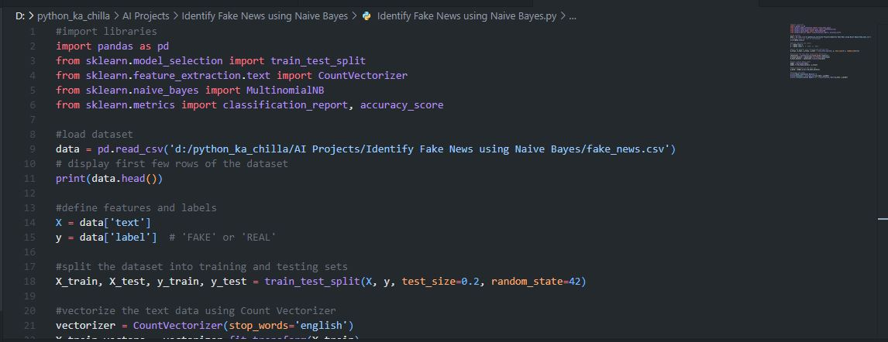
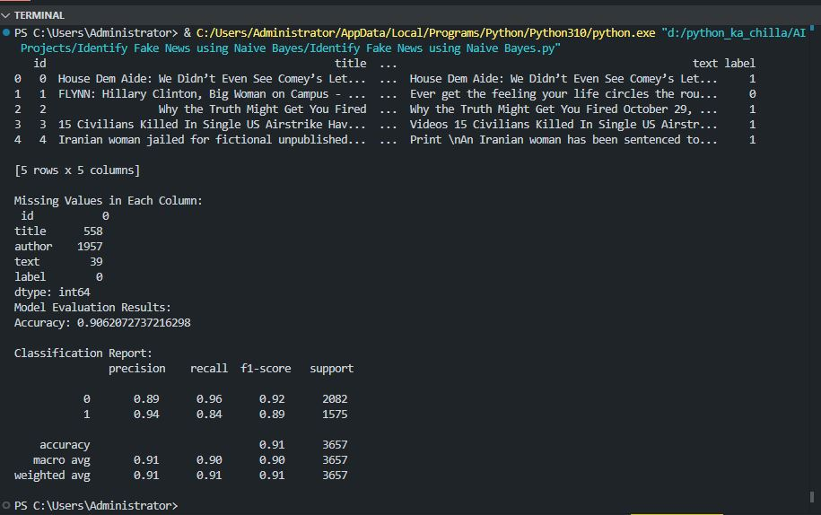

# 📰 Fake News Detection using Naive Bayes 🤖  
     

<p align="center">
  
</p>

🚀 This project builds a **machine learning model** to detect fake news articles using **Natural Language Processing (NLP)** techniques. It uses **CountVectorizer** to convert text into numerical features and trains a **Multinomial Naive Bayes** classifier to distinguish between real and fake news. The model achieves **~90% accuracy** on the test dataset.

---

## ✨ Key Features  
📝 **Text Preprocessing** – Handles missing values and vectorizes text  
🔤 **CountVectorizer** – Converts text to token counts  
🧠 **Naive Bayes Classifier** – Simple yet effective probabilistic model  
📊 **Model Evaluation** – Accuracy and detailed classification report  
📚 **Real Dataset** – Uses a labeled dataset of news articles  
🔍 **Fake News Detection** – Identifies deceptive news with high accuracy  

---

## 🧠 Tech Stack  
- **Language:** Python 🐍  
- **Libraries:** pandas, scikit-learn  
- **NLP Techniques:** CountVectorizer  
- **Model:** Multinomial Naive Bayes  
- **Evaluation:** Accuracy, Precision, Recall, F1‑Score  

---

## 📦 Installation  

```bash
git clone https://github.com/SayabArshad/Fake-News-Detection-Naive-Bayes.git
cd Fake-News-Detection-Naive-Bayes
pip install pandas scikit-learn
````

⚙️ Note: The dataset (fake_news.csv) is not included due to size. You can download a suitable fake news dataset (e.g., from Kaggle) and place it in the project folder as fake_news.csv. The script expects columns: text (news content) and label (0 for real, 1 for fake or similar).

---

## ▶️ Usage

Run the main script:

```bash
python "Identify Fake News using Naive Bayes.py"
```

The script will:

Load the dataset.

Display missing values and drop rows with missing data.

Split data into training and testing sets.

Vectorize text using CountVectorizer.

Train a Multinomial Naive Bayes model.

Print accuracy and classification report.

---

## 📁 Project Structure

```
Fake-News-Detection-Naive-Bayes/
│-- Identify Fake News using Naive Bayes.py  
│-- README.md                                    
│-- assets/                                      
│    ├── code.JPG
│    └── output.JPG
```

---

## 🖼️ Interface Previews

## 🖼️ Interface Previews

| 📝 Code Snippet | 📊 Console Output |
|:---------------:|:-----------------:|
|  |  |

---

## 💡 About the Project

Fake news has become a significant problem in the digital age, influencing public opinion and spreading misinformation. This project demonstrates how Natural Language Processing and machine learning can help identify deceptive news articles. Using a dataset of labeled news, the pipeline applies CountVectorizer to convert text into numerical features, then trains a Multinomial Naive Bayes classifier. The model learns patterns that distinguish real news from fake ones. With an accuracy of around 90%, it provides a solid baseline for fake news detection and can be extended with more advanced techniques.

---

## 🧑‍💻 Author

**Developed by:** [Sayab Arshad Soduzai](https://github.com/SayabArshad) 👨‍💻

📅 **Version:** 1.0.0

📜 **License:** MIT License


---

## ⭐ Contributions

Contributions are welcome! Fork the repository, open issues, or submit pull requests to enhance functionality (e.g., adding more preprocessing, trying different classifiers, or building a web interface).
If you find this project helpful, please ⭐ star the repository to show your support.

---

## 📧 Contact

For queries, collaborations, or feedback, reach out at **[sayabarshad789@gmail.com](mailto:sayabarshad789@gmail.com)**

---

📰 Separating fact from fiction, one article at a time.

---

